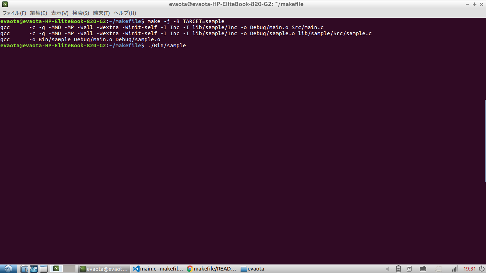
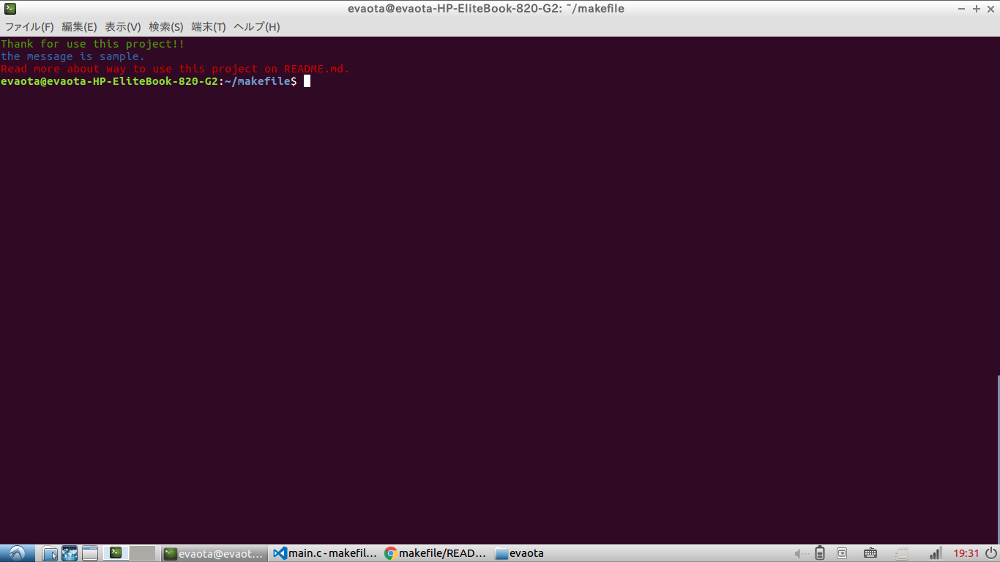

# プロジェクトの仕様  

- ## このプロジェクトについて  
Makefileを使用し、本来一つ一つコンパイルしなければならない複数のソースコードをコマンド一つで、一括コンパイルできるようにしました。

- ## このプロジェクトの使い方  
ユーザーは、***Inc Src lib/hoge/Inc lib/hoge/Src*** の中にファイルを作成しプログラムを書きます。
そして、端末を開きプロジェクトのディレクトリまで移動し,makeを叩くとコンパイルされます。コンパイル成功後、BinフォルダとDebugフォルダが生成され、その中に
実行ファイルとオブジェクトファイルが生成されます。

- ## コマンド一覧
| コマンド | 内容 |
|:---------:|:------------------------------------------------------|
| make | すべてのソースファイルがコンパイルされBinフォルダに実行ファイルが生成されます。 |
| make clean | Debug Binフォルダが消去され、実行ファイル、オブジェクトファイルが消去されます。 |
| make -j | コンパイル時CPUが並列で処理します。他のオプションと兼用可能 |
| make -B | すべてのファイルが強制的に再コンパイルされます。 |
| make TARGET=project-name | 生成する実行ファイル名をproject-nameで指定します。 デフォルトではproject |

- ## プロジェクトツリー
~~~:txt
.
├── Inc
│  └── main.h
├── Src
│  └── main.c
├── lib
│  └── sample
│      ├── Inc
│      │  └── sample.h
│      └── Src
│          └── sample.c
├── Bin
│  ├──実行ファイル
├──Debug
│  ├──オブジェクトファイル
├── Makefile
├── README.md
~~~
- ## 各ディレクトリの説明
    - Inc・・・Srcディレクトリに含まれるソースファイルのヘッダーファイルを入れます。
    - Src・・・メインのプログラムを記述するソースファイルを入れます。
    - lib・・・このフォルダーは配布、作成されたライブラリを入れるフォルダーです。
      ディレクトリツリーのsampleの通り各ライブラリのフォルダーを作成し、その中にInc(インクルード)Src(ソース)フォルダーも作成します。  
      **Inc Srcフォルダーを作成しないとコンパイルされません。**
    - Bin・・・実行ファイルが出力されるフォルダーです。./Bin/projectで実行します。(default)
    - Debug・・・コンパイル時に生成されるオブジェクトファイルと依存関係ファイルが出力されます。

## おまけ
  main.cの"#define SAMPLE 0 "を1にしてコンパイルすると画像２のように出力されます。
  プロジェクトの使い方の参考にしてください。実行環境:ubuntu16.04　端末にて
### 画像１：サンプルのコンパイル　※出力ファイルをsampleに指定。

### 画像２：サンプルの実行

